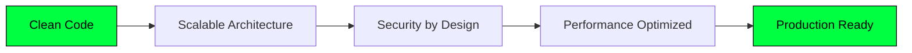

<div align="center">
  
# 👨‍💻 ZINE EDDINE ROUABAH


[](https://github.com/xCyberpunkx)
[](https://github.com/xCyberpunkx?tab=followers)
[](https://github.com/xCyberpunkx)
  
</div>

---

## 🧠 `$ whoami`

```cpp
#include <iostream>
#include <vector>
#include <string>
#include <map>

class SoftwareEngineer {
private:
    std::string name = "Zine Eddine Rouabah";
    std::string role = "Software Engineer & Network Architect";
    
    std::map<std::string, std::vector<std::string>> expertise = {
        {"Backend", {"C/C++", "Python", "Rust", "Node.js", "API Design"}},
        {"Frontend", {"React", "Next.js", "TypeScript", "Tailwind CSS"}},
        {"Systems", {"Linux Kernel", "Memory Management", "Concurrency"}},
        {"Network", {"TCP/IP", "Socket Programming", "Network Security"}},
        {"DevOps", {"Docker", "Kubernetes", "CI/CD", "Cloud Architecture"}}
    };
    
    std::string currentFocus = "Building distributed systems that scale";
    
public:
    void introduce() {
        std::cout << "╔════════════════════════════════════════════════════════╗\n"
                  << "║ Name: " << name << std::string(28 - name.length(), ' ') << "║\n"
                  << "║ Role: " << role << std::string(28 - role.length(), ' ') << "║\n"
                  << "║ OS: Arch Linux (performance matters)                   ║\n"
                  << "║ Philosophy: Clean code + Security + Performance        ║\n"
                  << "║ Status: " << currentFocus << std::string(31 - currentFocus.length(), ' ') << "║\n"
                  << "╚════════════════════════════════════════════════════════╝\n";
    }
    
    void printStack() {
        for (const auto& [domain, skills] : expertise) {
            std::cout << "├─ " << domain << ": ";
            for (size_t i = 0; i < skills.size(); ++i) {
                std::cout << skills[i] << (i < skills.size() - 1 ? " | " : "\n");
            }
        }
    }
};
```

<div align="center">
  
### 🎯 Engineering Excellence Across The Stack

</div>

<table align="center">
<tr>
<td width="50%" valign="top">

**🔧 Backend Engineering**
- RESTful & GraphQL API design
- Microservices architecture
- Database design & optimization
- Async programming & concurrency
- Message queues & event streams

</td>
<td width="50%" valign="top">

**🎨 Frontend Development**
- Modern React & Next.js
- TypeScript & type safety
- Responsive UI/UX design
- State management patterns
- Performance optimization

</td>
</tr>
<tr>
<td width="50%" valign="top">

**⚙️ Systems Programming**
- Low-level C/C++ development
- Memory management & profiling
- Network socket programming
- Binary analysis & debugging
- Performance optimization

</td>
<td width="50%" valign="top">

**🌐 Network Engineering**
- TCP/IP protocol suite
- Network security & firewalls
- Load balancing & proxies
- VPN & tunneling protocols
- CCNA path (in progress)

</td>
</tr>
<tr>
<td width="50%" valign="top">

**🐧 Linux & DevOps**
- Linux system administration
- Shell scripting & automation
- Docker containerization
- Kubernetes orchestration
- CI/CD pipeline design

</td>
<td width="50%" valign="top">

**🔐 Security Engineering**
- Secure coding practices
- Vulnerability assessment
- Penetration testing basics
- Cryptography fundamentals
- Security by design principles

</td>
</tr>
</table>

---

## 🛠️ Technology Stack

<div align="center">

### 💻 Languages


### 🎨 Frontend Technologies


### ⚙️ Backend & Databases


### 🔧 DevOps & Tools


### 🛡️ Security & Network Tools


</div>

---

## 🎯 Current Roadmap

```bash
#!/bin/bash

# Software Engineering Mastery Path
declare -A ROADMAP=(
    ["Backend"]="Building scalable microservices with modern architectures"
    ["Frontend"]="Crafting pixel-perfect, performant user interfaces"
    ["Systems"]="Deep diving into Linux kernel & network programming"
    ["Network"]="Pursuing CCNA certification & advanced networking"
    ["DevOps"]="Mastering container orchestration & cloud infrastructure"
    ["Security"]="Implementing security-first design patterns"
    ["Open Source"]="Contributing to impactful open-source projects"
)

echo "┌─────────────────────────────────────────────────────┐"
echo "│          2025 ENGINEERING OBJECTIVES                │"
echo "└─────────────────────────────────────────────────────┘"

for domain in "${!ROADMAP[@]}"; do
    printf "├─ %-12s → %s\n" "[$domain]" "${ROADMAP[$domain]}"
done

echo "└─────────────────────────────────────────────────────┘"
echo "[STATUS] All systems operational. Building the future..."
```

---

## 🏗️ Featured Projects & Architecture

<div align="center">



</div>

### 🚀 Project Highlights

<table>
<tr>
<td width="50%">

**Systems & Performance**
- Custom memory allocators
- Network protocol implementations
- Multi-threaded server architectures
- Performance profiling tools

</td>
<td width="50%">

**Web Applications**
- Full-stack web applications
- RESTful API services
- Real-time data dashboards
- Responsive SPA interfaces

</td>
</tr>
</table>

---

## 📊 GitHub Analytics & Metrics

<div align="center">
  
  
  

</div>

<div align="center">
  
  

</div>

<div align="center">
  
  

</div>

---

## 🏆 Achievements & Milestones

<div align="center">

[](https://github.com/ryo-ma/github-profile-trophy)

</div>

<div align="center">

### 📚 Continuous Learning

| Area | Current Focus | Status |
|------|---------------|--------|
| 🌐 Networking | CCNA Certification | `██████░░░░` 60% |
| 🔧 Systems | Linux Kernel Deep Dive | `████░░░░░░` 40% |
| ☁️ Cloud | AWS Solutions Architect | `███░░░░░░░` 30% |
| 🔐 Security | Ethical Hacking Basics | `█████░░░░░` 50% |

</div>

---

## 💭 Engineering Philosophy

<div align="center">

```ascii
╔════════════════════════════════════════════════════════════════════╗
║                                                                    ║
║  "Write code that humans can understand, machines will follow."   ║
║                                                                    ║
║  "Security is not a feature—it's the foundation."                 ║
║                                                                    ║
║  "Optimize for readability first, performance second, ego never." ║
║                                                                    ║
║  "Good architecture is about the decisions you DON'T make."       ║
║                                                                    ║
║  "Test your code like your job depends on it. It does."           ║
║                                                                    ║
╚════════════════════════════════════════════════════════════════════╝
```

</div>

---

## 📈 Coding Activity

<div align="center">

<!--START_SECTION:waka-->
```text
C++          8 hrs 32 mins   ████████████░░░░░░░░░   48.2%
JavaScript   3 hrs 45 mins   █████░░░░░░░░░░░░░░░░   21.1%
Python       2 hrs 18 mins   ███░░░░░░░░░░░░░░░░░░   13.0%
TypeScript   1 hr 42 mins    ██░░░░░░░░░░░░░░░░░░░    9.6%
Bash         1 hr 12 mins    █░░░░░░░░░░░░░░░░░░░░    6.8%
Other        15 mins         ░░░░░░░░░░░░░░░░░░░░░    1.3%
```
<!--END_SECTION:waka-->

</div>

---

## 🤝 Let's Connect & Collaborate

<div align="center">

[](https://github.com/xCyberpunkx)
[](https://www.linkedin.com/in/zine-eddine-rouabah-992b16265)
[](mailto:rouabah.zineedinee@gmail.com)
[](https://zineddine.vercel.app/)
[](https://twitter.com/xCyberpunkx)

</div>

---

<div align="center">
  
### 💬 Open to Opportunities


</div>

<div align="center">

### 🎓 Currently Learning


</div>

---

<div align="center">
  
  
  
  
  
  <br/><br/>
  
  
  
  <br/>
  
  **⭐ Found something interesting? Star the repo and let's build together!**
  
  <br/>
  
  
  
</div>
